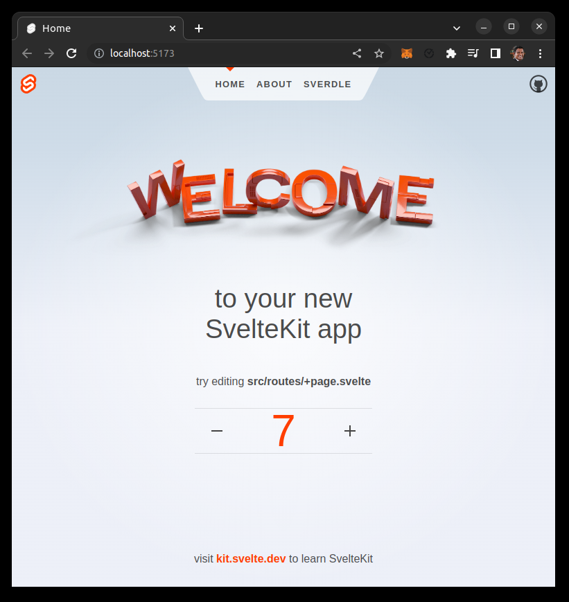
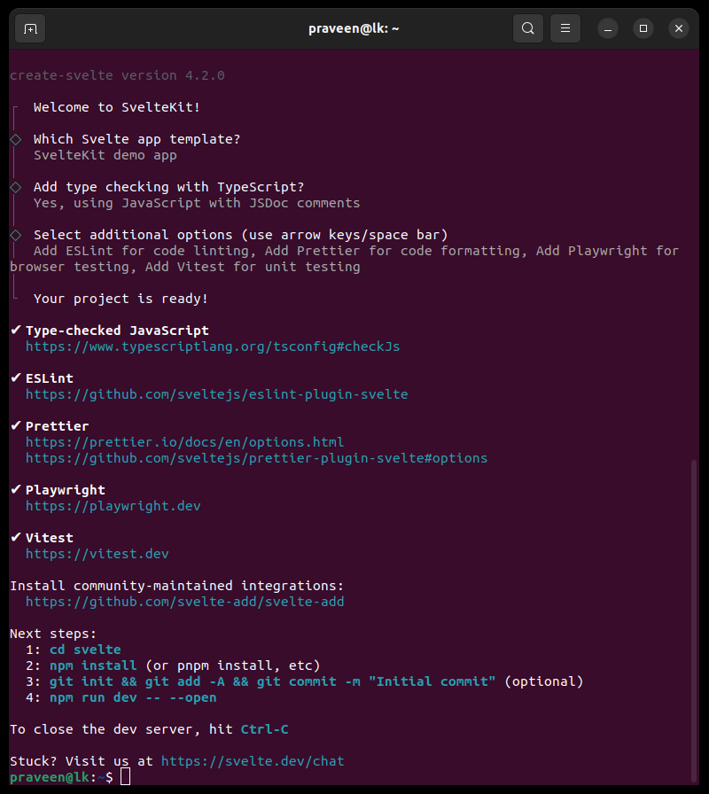
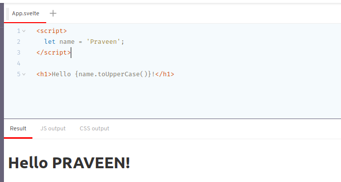
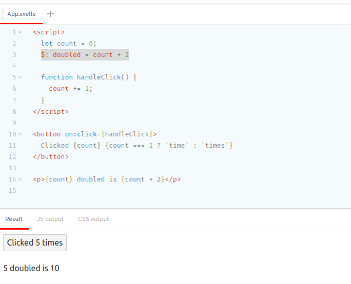
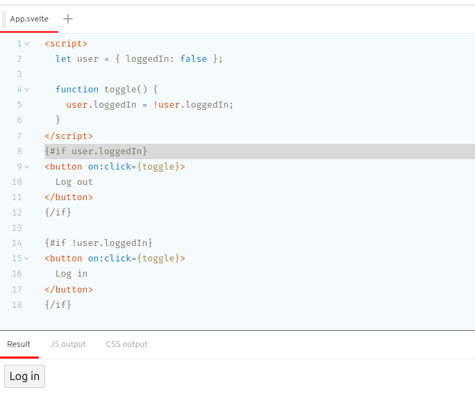

# Svelte KIT


# Svelte

https://svelte.dev/tutorial/basics




## Creating a project

```bash
npm create svelte@latest
npm create svelte@latest my-app
```

## Developing

```bash
npm run dev
npm run dev -- --open
```

## Building

```bash
npm run build
npm run preview
```




# Hello Svelte!




# $: doubled = count * 2

> Don't worry if this looks a little alien. It's valid (if unconventional) JavaScript, which Svelte interprets to mean 're-run this code whenever any of the referenced values change'. Once you get used to it, there's no going back.



# {#if user.loggedIn}

