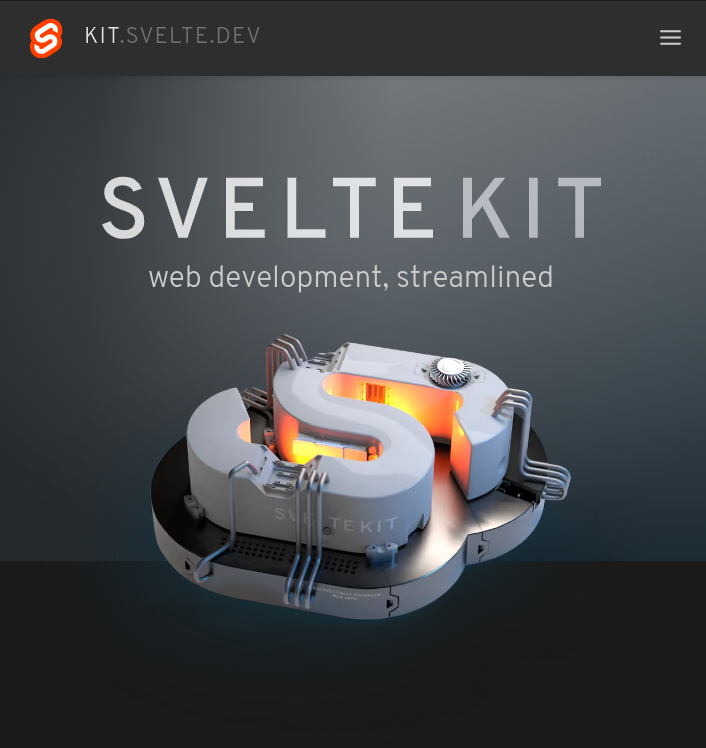
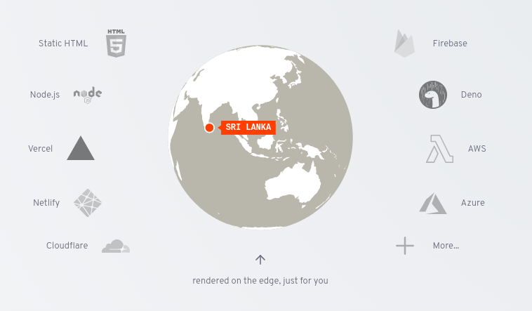

# Svelte

https://svelte.dev/tutorial/basics


## Creating a project

```bash
npm create svelte@latest
npm create svelte@latest my-app
```

## Developing

```bash
npm run dev
npm run dev -- --open
```

## Building

```bash
npm run build
npm run preview
```


# Hello Svelte!


# Svelte KIT



